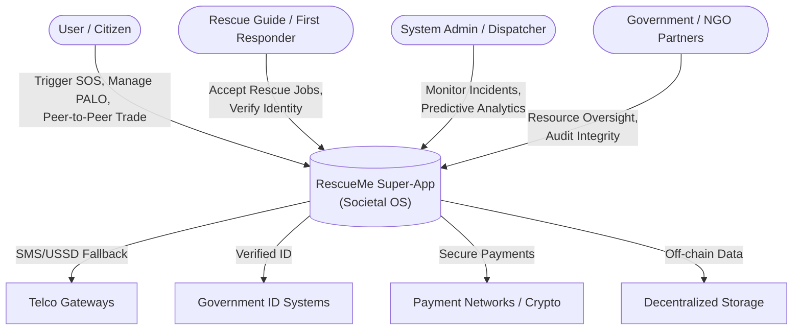
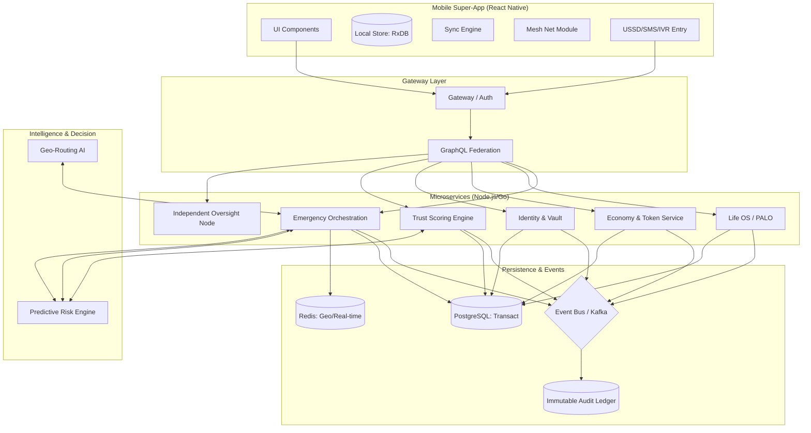

# RescueMe: Detailed System Architecture

This document provides a deep dive into the technical architecture of RescueMe, designed to be a world-class, resilient, and scalable societal operating system.

## 1. System Context (C4 Level 1)

## 2. Container Architecture (C4 Level 2)

## 3. World-Class Technical Decisions

### Trust as Infrastructure
*   **Trust Scoring Engine**: We implement a weighted reputation algorithm. High-integrity actions (verified rescues, community validation) increase the score, while false alarms or SLA violations throttle access.
*   **Immutable Audit Ledger**: Every incident lifecycle is hashed into an append-only store. **Independent Oversight Nodes** allow external regulators to verify integrity without compromising user PII (Personally Identifiable Information).

### Resilience: The "Always On" Strategy
*   **Multi-Channel Entry**: A dedicated **Telecom Gateway** service ensures that USSD/SMS triggers are treated with the same priority and orchestration flow as mobile app SOS signals.
*   **Life OS / Longitudinal Health**: The system doesn't just react; it monitors longitudinal "Societal Resilience" data (anonymized) to predict where resources will be needed next month, not just next minute.

### Trust: Sovereignty & Audit
*   **DID (Decentralized Identity)**: We use the **W3C Decentralized Identifiers** standard. User's medical data is encrypted with their private key; even the database admin cannot read it.
*   **Whistleblowing**: Reports are hashed and stored on a **Hyperledger Fabric** or similar private ledger. This creates an immutable "truth record" that can be audited by third-party NGOs to prevent government censorship.

### Intelligence: Proactive Rescue
*   **Predictive Dispatch**: Using **Python/TensorFlow** to analyze "Incident Heatmaps." If the system detects a pattern (e.g., increasing social unrest or flash floods), it automatically increases "Rescue Guide" rewards in that vicinity to ensure standby capacity.
*   **Emotional AI**: In-app voice recordings for distress are analyzed for high cortisol levels or specific keywords, instantly boosting incident priority.

## 4. Scalability: From Village to Nation
*   **Regional Sharding**: Data is sharded by administrative regions (States/Provinces).
*   **Edge Caching**: Static content and "Knowledge Hub" articles are cached at local regional hubs (Solar-powered access units) to minimize bandwidth.

---

> [!TIP]
> **Suggested Implementation Stack:**
> *   **Frontend**: React Native, Next.js, Tailwind CSS
> *   **Backend**: Node.js (Express/NestJS) for logic, Go for high-performance ERS routing.
> *   **Events**: Apache Kafka for massive event throughput.
> *   **Workflow**: Temporal for reliable rescue flows.
> *   **Blockchain**: Polygon (for Tokens) & Hyperledger Fabric (for Audit Trails).
